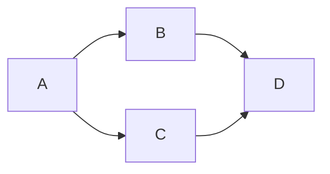

#  Git_Syntax
  
[Developement Notebook](Table%20of%20Contents.md )
_______________________________________________________
  
##  Table of Contents
  
**Commands** <br>
Initiate_Repository <br>
Add_Changes <br>
Commit_Changes <br>
Push_Changes <br>
Status <br>
Log <br>
  
**Sequences** <br>
Commit Changes <br>
Set the location of a Remote Repo <br>
Set the locations of multiply Remote Repos <br>
Reset the location of a Remote Repo <br>
Push Changes to a Remote Repo <br>
  
**References**
  
[References](#References )
_______________________________________________________
##  Command_Catalog_Entry_Format
  
The `Command` command wil... <br>
| Input | Return | 
|---|---|
|`command`  |description | 
<br>
  
_______________________________________________________
  

  
##  Terms to Catalog
  
  
`git init` 
  
`git add` 
  
`git clone`
  
`git commit`
  
`git pull`
  
`git push`
  
`git checkout`
  
`git merge`
  
`git reset`
  
`git remote`
  
`git log`
  
_______________________________________________________
  
##  Sequence_Catalog_Entry_Format
  
  
  
  
_______________________________________________________
##  Sequences to Catalog
  
  
  
```bash
mkdir NewFolder
git init
touch NewFile.txt
~open the file and adjust the content~
git add
git commit
```
  
  
###  To Create a folder, commit changes, and push to a remote repo
  
  
``` bash
cd ~/Desktop
mkdir NewFolder
git init
git add -A
git status
git commit -m "This is my message"
git log
*create remote github repo on github.com, copy the repo address to the clickboard
git remote add origin https://github.address
git push origin master
*username: sassypigeon
*password: ***********
```
  
###  To Change the Remote Repo setting of a local Repo
  
  
``` bash
*to view the current url attached to the push command of the repo
git remote -v
*alternatively you can also use `git remote show origin`
*to change the url 
git remote set-url <remote_name> <remote_url>
  
```
  
###  To create multiple remotes 
  
  
``` bash
*git remote add <remote 1 name> <remote 1 url>
*git remote add <remote 2 name> <remote 2 url>
  
mkdir NewFolder
git init
git remote add origin <origin url>
git remote add upstream <upstream url>
git remote -v
```
  
  
  
____________________________________________________________
##  References
  
  
[Essential Git Commands](https://dev.to/dhruv/essential-git-commands-every-developer-should-know-2fl )
  
[Basic Git Commands](https://confluence.atlassian.com/bitbucketserver/basic-git-commands-776639767.html )
  
[joshnh Git Commands](https://raw.githubusercontent.com/joshnh/Git-Commands/master/READMEpt.md )
  
  
____________________________________________________________
  
[Top of Page](#Git_Syntax )
  